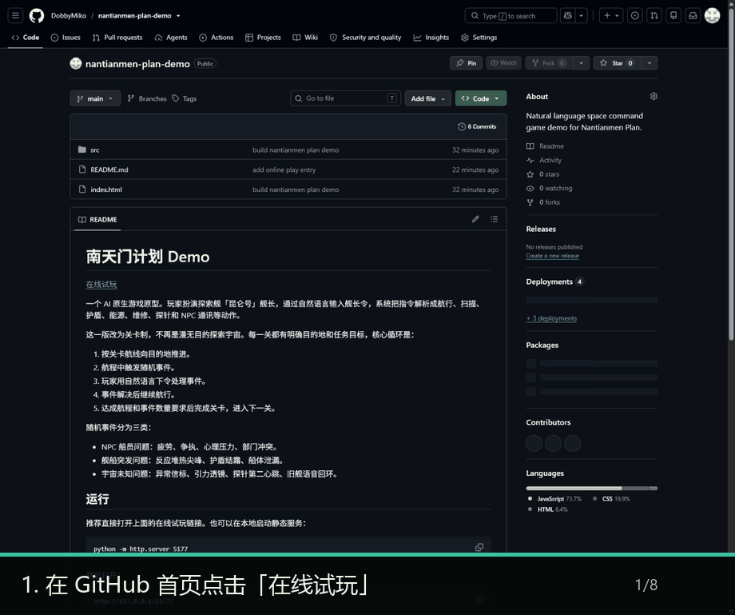

# 南天门计划 Demo

## 开始游戏

[点击这里在线试玩](https://dobbymiko.github.io/nantianmen-plan-demo/)

不需要安装，也不需要 API Key。打开链接后可以直接用本地解析器试玩；如果你填入自己的 OpenRouter API Key，船员回复会更自然。



## 怎么玩

1. 打开在线试玩链接，等待舰桥初始化和船员报备完成。
2. 在“舰长发言”输入自然语言命令，例如：`点火，启动主推进，按关卡航线前往月背 L2 中继站。`
3. 飞船起航后会触发事件，例如“货舱里的猴子”。继续用自然语言安排船员处理：`秦昭封锁货舱，何弈扫描生命体来源，林澈保护维护管线。`
4. 当前事件解决后，输入“继续航行”类命令推进航程。遇到新事件时，先处理事件，再继续航行。
5. 航程达到 100%，并完成本关要求的事件数后，点击“下一关”进入下一航段。

一个 AI 原生游戏原型。玩家扮演探索舰「昆仑号」舰长，通过自然语言输入舰长令，系统把指令解析成航行、扫描、护盾、能源、维修、探针和 NPC 通讯等动作。

这一版改为关卡制，不再是漫无目的探索宇宙。每一关都有明确目的地和任务目标，核心循环是：

1. 按关卡航线向目的地推进。
2. 航程中触发随机事件。
3. 玩家用自然语言下令处理事件。
4. 事件解决后继续航行。
5. 达成航程和事件数量要求后完成关卡，进入下一关。

随机事件分为三类：

- NPC 船员问题：疲劳、争执、心理压力、部门冲突。
- 舰船突发问题：反应堆热尖峰、护盾结霜、船体泄漏。
- 宇宙未知问题：异常信标、引力透镜、探针第二心跳、旧舰语音回环。

## 运行

推荐直接打开上面的在线试玩链接。也可以在本地启动静态服务：

```bash
python -m http.server 5177
```

然后打开：

```text
http://127.0.0.1:5177/
```

## AI / BYOK

- 支持 BYOK：在界面里填入自己的 OpenRouter API Key。
- OpenRouter 官网：https://openrouter.ai/
- 程序内部会自动请求 OpenRouter API；玩家不需要在浏览器里打开接口地址。
- 默认 `model_id`：`openai/gpt-4.1-mini`
- 可在界面中改成其他 OpenRouter model slug。
- token 用量会在舰桥右上角累计显示。
- 勾选“本机记住 key”才会把 key 写入 `localStorage`，否则只写入 `sessionStorage`。
- AI 请求会带上当前关卡、航程、已触发事件和 activeEvent，让模型优先解析“如何解决当前事件”。

没有 key 时，demo 会使用本地规则解析器兜底，方便直接试玩和查看代码。

## 源码

源码在本仓库中可直接查看，主要文件如下：

- [index.html](index.html)
- [src/styles.css](src/styles.css)
- [src/main.js](src/main.js)
- [README.md](README.md)

核心流程：

1. 玩家提交自然语言舰长令。
2. 如果开启 AI 且存在 OpenRouter key，请求模型返回 JSON 指令。
3. 如果 AI 不可用，使用本地解析器生成同样结构的动作。
4. 游戏运行时把动作应用到舰艇状态、NPC 通讯、日志和太空视窗。
5. 关卡系统根据动作判断是否解决 activeEvent；无未解决事件时，继续航行类命令推进航程。

OpenRouter 官方文档入口：https://openrouter.ai/docs/quickstart
